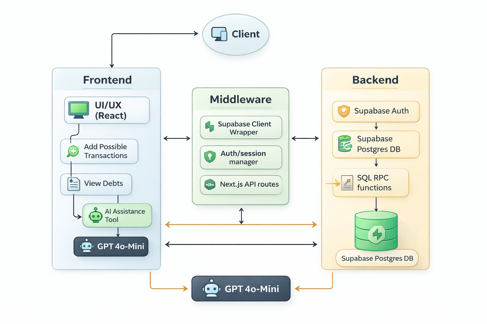

  # 🏠💸 Roomies Ledger

<p align="center">
  
</p>


**A modern expense-splitting app for roommates — track shared purchases, split bills (equal/custom/%), and settle up fast.**  
Built for hackathons, dorms, apartments, and anyone tired of “who owes who?” texts.


---

## 🏷️ Badges

[](#)


---

## ⚡ TL;DR

- ✅ **Auth + Profiles** (Supabase Auth + `profiles` table + auto-profile trigger)
- 🏘️ **Multi-household groups** with **invite codes**
- 🧾 Add transactions with:
  - ➗ **Equal split**
  - 🧮 **Custom amounts**
  - 📊 **Percent split**
- 💱 Optional **multi-currency input** + stored **exchange rate**
- 🔁 **Recurring expense flag**
- 🔐 **Row-Level Security (RLS)** across tables
- 🧪 Demo mode: **seed 3 users + 3 households** via `/api/seed`

---

## 📚 Table of Contents

- [Inspiration](#-inspiration)
- [What it does](#-what-it-does)
- [How it works](#-how-it-works)
- [Key features](#-key-features)
- [Architecture](#-architecture)
- [Tech stack](#-tech-stack)
- [Database schema](#-database-schema)
- [Security (RLS)](#-security-rls)
- [Quick start](#-quick-start)
- [Environment variables](#-environment-variables)
- [Migrations + RPCs](#-migrations--rpcs)
- [Demo seeding](#-demo-seeding)
- [Usage](#-usage)
- [Project structure](#-project-structure)
- [Troubleshooting](#-troubleshooting)
- [Roadmap](#-roadmap)
- [Credits](#-credits)
- [License](#-license)

---

## 💡 Inspiration

Roommates split groceries, utilities, random Target runs, and it always turns into:
- “Did you Venmo me?”
- “I paid last time”
- “Wait how much do I owe?”

Roomies Ledger makes it **dead simple** to track shared spending and settle up.

---

## ✅ What it does

Roomies Ledger lets you:

- **Create or join a household** using an invite code
- **Add an expense** with:
  - amount + date + optional place
  - payer selection
  - split type: equal / custom amounts / percentages
- View transactions in a clean feed + drill into details
- See **net balances** and **who should pay whom** to settle

---

## 🧠 How it works

1. **Auth:** Supabase Auth signs users in/out.
2. **Profile:** A trigger creates a `profiles` row on signup (`handle_new_user`).
3. **Groups:** Users can create a group (with an invite code) or join an existing one by code.
4. **Members:** `group_members` ties users ↔ groups and stores permissions.
5. **Transactions:** Stored per group, always normalized to **group currency** (with optional original currency metadata).
6. **UI:** Transaction creation is a 3-step sheet: details → amount → split.

---

## ✨ Key features

### 🏘️ Groups + Invite Codes
- Create a household → invite roommates with a short code
- Join household with code → instant access to the group’s transactions

### 🧾 Transaction flow (3-step)
- **Step 1:** Title, date, place, payer
- **Step 2:** Amount + currency + optional receipt + recurring toggle
- **Step 3:** Split equal / exact / percentage

### 💱 Multi-currency input (optional)
- Input expense in a different currency than the group
- Store:
  - `originalCurrency`
  - `originalAmount`
  - `exchangeRate`
- Normalize to group currency so balances stay consistent

### 🔁 Recurring payments
- Tag expenses as recurring with:
  - daily / weekly / biweekly / monthly / yearly

### 🧪 Demo accounts + households
- `/api/seed` creates demo users + groups so judges can try it instantly

---

## 🏗️ Architecture

**Frontend**
- Next.js + React + TypeScript
- UI: shadcn/ui + Tailwind
- State: `useStore()` (central store)

**Backend**
- Supabase:
  - Postgres tables + RLS policies
  - Auth + profiles trigger
  - SQL RPCs for group creation + join by invite code
 
  

---

## 🧰 Tech stack

- **Next.js**
- **React**
- **TypeScript**
- **Supabase** (Auth + Postgres + RLS + RPC)
- **Tailwind CSS**
- **shadcn/ui**
- **date-fns**
- **lucide-react**

---

## 🗄️ Database schema

### `profiles`
Stores display name + avatar color for each auth user.

### `groups`
Households (name, currency, invite code, creator).

### `group_members`
Members tied to a group. Also holds permissions for actions like adding/deleting transactions.

### `transactions`
Expenses per group:
- normalized `amount` in group currency
- optional original currency metadata
- split metadata (equal/exact/percent)
- optional recurring + receipt URL


---

## 🔐 Security (RLS)

Row-level security is enabled for core tables. Policies ensure:
- users only see groups they belong to (and creators always see their own groups)
- members can only access transactions for groups they’re in
- write permissions are constrained by membership/ownership rules

---

## 🚀 Quick start

### 1) Install deps
```bash
npm install
